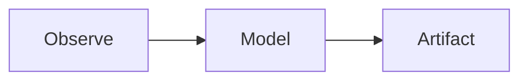

# potpuoy.com — Build Specification

## 1. Identity & Positioning

**Author:** Abhiraj Darshankar  
**Domain:** potpuoy.com  
**Project folder:** ~/Projects/ad_blog

**Core identity:**
> Systems craftsman — someone who learns the underlying mechanics of things (minds, machines, markets, tools, food, materials, organizations) and turns that understanding into useful artifacts.

**Tagline (choose one at launch):**
- *Understand the mechanism. Build the artifact.*
- *A workshop for hidden structure.*
- *Field notes on how things work.*

**What the blog is:**
> A public lab notebook for models, artifacts, experiments, and essays. Not just "I wrote an essay" — but "I observed something, modeled it, built a small artifact, visualized it, and explained what changed in my mind."

**What it is not:**
- An AI commentary blog
- A personal brand glossy portfolio
- A tutorial site
- A startup-coded blog with hero sections and CTAs

**Reader experience goal:**
> "I leave with a better model of something."

**Brand archetype:** Observatory / Workshop / Field Notes

---

## 2. Aesthetic & Design System

| Token | Value |
|---|---|
| Body font | `Georgia, Charter, 'Bitstream Charter', serif` |
| Structural / mono font | `ui-monospace, 'Cascadia Code', monospace` |
| Accent color | `#5c7a9e` (muted slate blue) |
| Prose max-width | `68ch` |
| Body font-size | `1.1rem` |
| Line-height | `1.7` |
| Dark mode | `color-scheme: light dark` (automatic, no toggle) |
| Spacing rhythm | `1rem` base unit, generous vertical whitespace |

**What to avoid:**
- No gradients
- No card grids
- No hero section
- No avatar in header
- No social share buttons
- No sidebar
- Tags are lowercase monospace — metadata, not decoration
- Decorative cleverness of any kind

**Visual tone:** Calm, sharp, curious, rigorous. Precision-first, not minimal-for-minimalism's-sake.

---

## 3. Site Structure & Pages

### Navigation
```
Writing  ·  Artifacts  ·  About  ·  Now
```

### Pages

| Route | Template | Purpose |
|---|---|---|
| `/` | `index.njk` | 2–3 sentence positioning statement + 10 most recent posts across all types |
| `/writing/` | `writing.njk` | All posts, reverse-chronological, filterable by type + tag |
| `/artifacts/` | `artifacts.njk` | Filtered view: build-log + model + interactive types only |
| `/about/` | `about.md` | Long-form: the systems craftsman framing, trajectory (circuits → minds → data → reasoning), what this blog is |
| `/now/` | `now.md` | Current obsessions — what I'm thinking about + what I'm making. Updated manually. |
| `/feed.xml` | Eleventy RSS plugin | RSS feed, last 20 posts |
| `/sitemap.xml` | Generated | Machine-readable index for search + AI agents |

---

## 4. Content Types

All content lives in `src/posts/`. Content type is declared in frontmatter as `type`.

| Type | Description | Friction | Example |
|---|---|---|---|
| `note` | Short observation. Still precise, not a tweet. | Low | "A thing I noticed about LLM calibration" |
| `mechanism` | How something actually works underneath. The core essay format. | Medium | "Why qualitative synthesis needs operators" |
| `build-log` | Artifact made, process documented. Makes theory real. | Medium | "Split keyboard: from circuit to daily tool" |
| `model` | Compressed framework for thinking. May include diagrams, small calculations. | Medium-high | "Debt payoff vs investing under different assumptions" |
| `interactive` | Essay with embedded demo/calculator. The most time-intensive. | High | "How LLM eval conclusions flip under judge noise" |

### Post Frontmatter

```yaml
---
title: ""
date: YYYY-MM-DD
type: note          # note | mechanism | build-log | model | interactive
tags: []            # see taxonomy below
summary: ""         # one sentence — what this post argues or shows
draft: false        # true = excluded from build
---
```

### Tag Taxonomy

**Domain tags:** `ai` · `cognition` · `markets` · `finance` · `craft` · `food` · `systems` · `tools` · `macro` · `software`

**Method tags:** `mechanism` · `synthesis` · `model` · `field-note` · `artifact`

Tags are lowercase. Use 2–4 per post. Method + domain (e.g., `mechanism` + `ai`).

### Post filename convention
```
YYYYMMDD-short-slug.md
```
Example: `20260626-rssl-reasoning-language.md`

---

## 5. Technical Stack

| Layer | Choice | Reason |
|---|---|---|
| Static site generator | Eleventy (11ty) v3 | Same as StackDiver reference. Zero framework. Markdown-first. |
| Templates | Nunjucks | Eleventy default, expressive enough for collections/filters |
| Styling | Plain CSS | No framework needed. ~100 lines. |
| Code highlighting | Shiki | Already in StackDiver. Build-time, zero runtime cost. |
| Diagrams | Mermaid (client-side) | One `<script type="module">` in base template. Write diagrams in MD code blocks. |
| RSS | `@11ty/eleventy-plugin-rss` | Standard, already in StackDiver |
| Interactivity | Vanilla JS only | Minimal — filtering on /writing, nothing else in V1 |
| Hosting | Netlify (primary) or GitHub Pages | Git push → build → publish |
| Deploy trigger | Git push to `main` | Netlify auto-build |

### Dependencies

```json
{
  "devDependencies": {
    "@11ty/eleventy": "^3.x",
    "@11ty/eleventy-plugin-rss": "^2.x",
    "shiki": "^3.x",
    "prettier": "^3.x"
  }
}
```

No React. No Next.js. No Tailwind. No build bundler beyond Eleventy itself.

---

## 6. Folder Structure

```
ad_blog/
├── src/
│   ├── posts/                    ← all content (YYYYMMDD-slug.md)
│   ├── _includes/
│   │   ├── base.njk              ← root HTML shell, nav, head
│   │   └── post.njk              ← individual post layout
│   ├── assets/
│   │   ├── images/               ← photos, screenshots
│   │   ├── diagrams/             ← SVG, Excalidraw exports
│   │   ├── plots/                ← Python-generated SVG/PNG charts
│   │   └── data/                 ← CSV, JSON source data
│   ├── demos/                    ← standalone HTML interactive tools
│   ├── style.css
│   ├── index.njk                 ← home page
│   ├── writing.njk               ← all posts listing
│   ├── artifacts.njk             ← filtered artifacts view
│   ├── about.md
│   └── now.md
├── scripts/
│   └── plots/                    ← Python scripts → src/assets/plots/
├── notebooks/                    ← Jupyter / Quarto source files
├── public/                       ← Eleventy build output (gitignored)
├── .eleventy.js
├── package.json
├── .gitignore
├── netlify.toml                  ← build config
└── SPECS.md                      ← this file
```

---

## 7. Asset Pipeline

### Images
Drop in `src/assets/images/`. Reference in Markdown:
```md

```

### Diagrams (Mermaid)
Write inline in any Markdown post:
````md

````
Renders client-side via Mermaid script. No build step.

### Diagrams (SVG / Excalidraw)
Export → drop in `src/assets/diagrams/` → reference in Markdown.

### Plots (Python-generated)
Workflow:
```
scripts/plots/mortgage_vs_invest.py
  → outputs → src/assets/plots/mortgage_vs_invest.svg
  → referenced in post → 
```
Scripts live in `scripts/plots/`. Not integrated into the Eleventy build in V1 — run manually before committing.

### Interactive Demos
Self-contained HTML files in `src/demos/`. Embedded in posts via iframe:
```md
<iframe src="/demos/mortgage-calculator.html" width="100%" height="400"></iframe>
```
Demos are standalone — they can use any JS internally without affecting the rest of the site.

---

## 8. Eleventy Configuration (`.eleventy.js`)

Key behaviors:
- Input: `src/`, output: `public/`
- Collections: `post` (all), `artifact` (type: build-log | model | interactive), `note` (type: note)
- Filters: `humanDate`, `machineDate`, `filterByType`, `filterByTag`
- Passthrough: `src/style.css`, `src/assets/**`, `src/demos/**`
- Plugins: RSS, IdAttribute, InputPathToUrl
- Shiki highlighting: `dark-plus` theme
- Mermaid: `<script>` injected in base template

---

## 9. Inspiration References

| Reference | What to borrow |
|---|---|
| StackDiver (Chuanqi Sun) | Structural base: minimal, dated posts, essay-first |
| Simon Willison | Notes + technical logs, short-form without over-polishing |
| Maggie Appleton | Visual essays, diagrams, humane technical writing |
| Bret Victor | Interactive artifacts, making abstractions visible |
| Jay Alammar | Visual ML / systems explanations |
| Matt Levine | Mechanism-first explanation across complex domains |
| Andy Matuschak | Machine-readable notes, public knowledge practice |

---

## 10. V1 Scope (build now)

- [x] Full Eleventy project scaffold
- [x] Base template (`base.njk`) with nav, head, Mermaid script
- [x] Post template (`post.njk`) with type/tag display
- [x] All five pages: home, writing, artifacts, about, now
- [x] CSS: serif body, mono structural, slate accent, auto dark mode
- [x] All content type frontmatter supported
- [x] Tag + type filtering on `/writing` (vanilla JS)
- [x] RSS feed at `/feed.xml`
- [x] Sitemap at `/sitemap.xml`
- [x] Asset folders scaffolded (images, diagrams, plots, data, demos)
- [x] Netlify deploy config (`netlify.toml`)
- [x] `.gitignore`
- [x] 3 starter posts: one `note`, one `mechanism`, one `build-log`
- [x] `npm run dev` works locally

## 11. V2 / Out of Scope

- Math rendering (KaTeX / MathJax)
- Python plot pipeline build integration
- Observable / Vega-Lite embeds
- Newsletter / email subscription
- Series / sequence pages
- Audio derivatives
- Digital garden / linked notes
- Video embeds
- Search
- Comments
