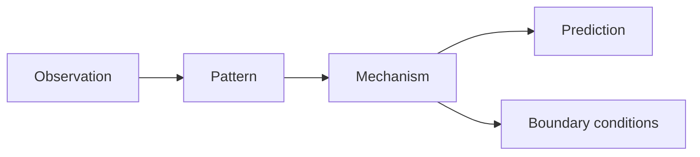

A model is a compression of reality. The question is: which features get preserved, and which get discarded?

Bad models discard the wrong features. They treat the map as the territory, fail at boundary cases, and give you false confidence precisely where you need real uncertainty. Good models do the opposite — they preserve what causally matters, make failure modes explicit, and tell you when they stop applying.

## The three properties

A useful model has:

1. **Mechanism** — it explains *why* the pattern holds, not just *that* it holds
2. **Boundary** — it tells you where it stops working
3. **Compression** — it reduces cognitive load without losing decision-relevant information

The mechanism is the load-bearing part. Without it, you have a mnemonic.

## An example

Two models of why startups fail:

**Model A:** "Startups fail because they run out of money."

**Model B:** "Startups fail because they solve problems that aren't painful enough for people to change their behavior."

Model A is a description. True, but it doesn't tell you what to do, where the boundary is, or how to test it. Model B has a mechanism (behavior-change threshold), a boundary (doesn't explain operational failures), and a prediction you can test by measuring switching costs.

The useful model is the one that constrains your expectations and tells you what evidence would change your mind.

## What this means for writing

Every post here tries to expose the mechanism underneath something. Not "this is interesting" but "here is why this works the way it does, where it breaks, and what you can do with that understanding."

If a post doesn't change what you'd predict about something, it didn't do its job.
